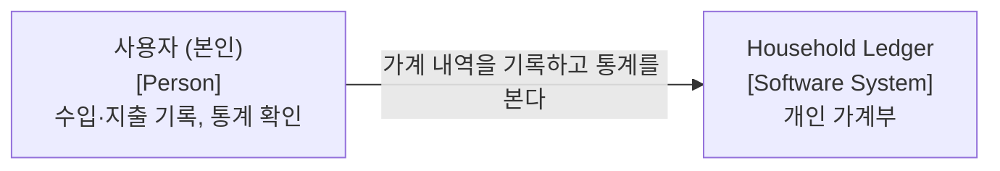
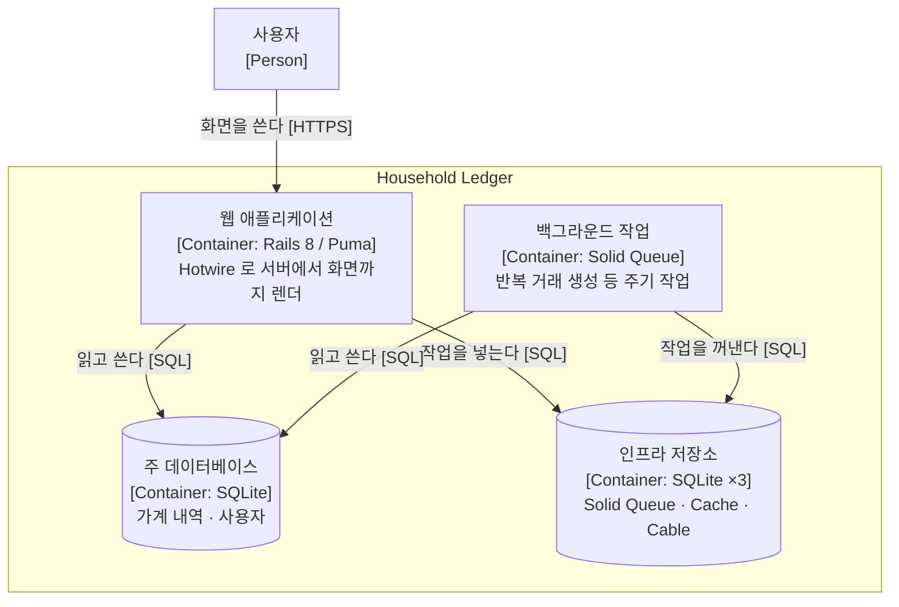

# Household Ledger — 아키텍처 문서

> **arc42** 구성. 그림은 **C4 Model**. · **as of 2026-09-03** (`main`, 커밋 105)
> 근거: `app/` · `config/` · `db/migrate/` · `Gemfile`
> 절에 적을 것이 없으면 비워두지 않고 `해당 없음 (날짜 검토). 이유: …` 를 적는다.

**갱신 트리거** — 구조·의존성이 바뀌면 §3·§5 를 본다. 배포 설정이 바뀌면 §7 을 본다.

---

## 1. 목표

개인 가계부. 수입·지출을 기록하고 분류·집계·시각화한다. **Ruby on Rails 학습이 1차 목적**이고 가계부는 그 소재다 — 이 성격이 [`../../CLAUDE.md`](../../CLAUDE.md) 의 작업 규범을 결정한다.

React + FastAPI + PostgreSQL 로 만들었던 것을 Rails 8 모놀리스로 **전면 재구축**했다. 옛 코드는 `legacy/react-fastapi` 브랜치에 있다.

**주요 기능** — 수입·지출 CRUD · 반복 거래 템플릿 · 카테고리(이모지·순서) · 태그 · 신용카드 · 달력 뷰 · 통계 · 자산 보정 · 대시보드

**품질 목표**
> 해당 없음 (2026-09-03 검토). 이유: **단일 사용자 개인 도구**라 성능·가용성 목표를 세울 대상이 없다. 이 프로젝트의 목표는 「Rails 를 배운다」이고 그것은 시스템 품질 속성이 아니다.

## 2. 제약

| 제약 | 내용 |
|---|---|
| **학습 목적** | Rails 백엔드 코드는 사람이 직접 쓴다 — AI 가 대신 쓰면 목적이 사라진다 |
| **단일 사용자** | 동시성·확장을 설계 대상으로 두지 않는다 |
| **SQLite** | 서버 프로세스 없이 파일로 끝낸다. 운영 요소를 최소로 |

## 3. 컨텍스트와 범위



**외부 인터페이스**
> 해당 없음 (2026-09-03 검토). 이유: 은행·카드 연동이 없고 전부 수기 입력이다. 나가는 호출이 없다.

## 4. 솔루션 전략

**Rails 8 의 기본값을 최대한 그대로 쓴다.** 학습이 목적이므로 관례에서 벗어나지 않는 것 자체가 전략이다.

| 영역 | 선택 | 왜 |
|---|---|---|
| 전체 | Rails 8 풀스택 모놀리스 | 프론트·백을 나누지 않아야 Rails 관례를 온전히 겪는다 |
| DB | **SQLite** | 서버 불필요. 개인 규모에 충분 |
| 화면 | ERB + Hotwire (Turbo · Stimulus) | SPA 없이 SPA 같은 UX. Rails 8 의 기본 노선 |
| CSS | Tailwind (rails 통합) | |
| JS | importmap-rails | npm 불필요 |
| 큐·캐시·케이블 | **Solid Queue · Solid Cache · Solid Cable** | 전부 DB 기반. Redis 를 안 들인다 |
| 인증 | Devise | |
| 배포 | **Kamal** (`config/deploy.yml`) | |

## 5. 빌딩 블록 뷰

### Level 1 — 컨테이너



### Level 2 — MVC 흐름

```
Request → Router (config/routes.rb)
           → Controller (app/controllers/)
              → Model (app/models/) ← ActiveRecord
              → View (app/views/)   ← ERB + Turbo
           → Response (HTML / Turbo Stream)
```

### 데이터 모델 (2026-09-03 실측 — 모델 9)

| 모델 | 핵심 필드 |
|---|---|
| `User` | email · encrypted_password (Devise) |
| `Category` | user_id · name · emoji · position (`acts_as_list`) |
| `Transaction` | user_id · date · description · amount · `transaction_type`(income/expense) · category_id · status(confirmed/scheduled/pending) · recurring_transaction_id |
| `RecurringTransaction` | template_name · amount · `transaction_type` · frequency(weekly/monthly/yearly) · start_date · end_date · day_of_month · is_active · is_variable_amount · `discarded_at` |
| `AssetAdjustment` | adjustment_date · amount · `adjustment_type`(income_missing/expense_missing) |
| `Tag` · `Tagging` | 거래에 붙이는 자유 태그 (다대다) |
| `CreditCard` | 카드 단위 관리 |

**컨트롤러 10** — transactions · categories · recurring_transactions · asset_adjustments · statistics · tags · taggings · credit_cards · dashboard · application

## 6. 런타임 뷰

> 해당 없음 (2026-09-03 검토). 이유: 요청-응답과 큐 작업 하나뿐이라 순서를 그려서 얻는 것이 없다. 비동기 협력이 늘면 켠다.

## 7. 배포 뷰

**Kamal** 로 Docker 이미지를 만들어 단일 호스트에 올린다. SQLite 파일이 볼륨으로 붙는다.
설정 — `config/deploy.yml` · `Dockerfile` · `infra/`

## 8. 횡단 개념

### 8.1 명명 규약 — `type` 컬럼 금지

`type` 은 Rails STI 예약어다. **`transaction_type` · `adjustment_type` 으로 명명한다.** 어기면 ActiveRecord 가 상속으로 오해한다.

### 8.2 삭제 — Soft Delete

`discard` gem 으로 `discarded_at` 을 쓴다. 물리 삭제하지 않는다.

### 8.3 순서 — `acts_as_list`

`position` 컬럼으로 관리한다(옛 `order` 대응).

### 8.4 열거 — Rails 내장 `enum`

별도 Enum 파일을 만들지 않는다.

### 8.5 태그 분화 판단

`tag_type` 으로 태그를 갈래 나눌지는 **집계 단위가 필요할 때만** 정당하다 — 「후배에게 베풂」·「친구에게 베풂」을 각각 두고 「베푼 총액」으로 합산해야 할 때. 하나로 충분하면 일반 태그로 둔다.

### 8.6 한국어 현지화

UI 텍스트 전부 `config/locales/ko.yml`. 날짜 `YYYY년 MM월 DD일` · 통화 원(KRW).
온보딩 시 기본 카테고리 13개 자동 생성 — 식비 · 간식류 · 카페 · 교통 · 생활용품 · 건강/의료 · 문화/여가 · 의류/미용 · 통신 · 교육 · 경조사/선물 · 기타지출 · 저축/투자

## 9. 아키텍처 결정

> 아직 없음. ADR 을 쓰기 시작하지 않았다. 신규 결정부터 `docs/adr/NNNN-*.md` 로 적는다.

## 10. 품질 요구사항

> 해당 없음 (2026-09-03 검토). §1 참조 — 단일 사용자 개인 도구라 측정할 품질 시나리오가 없다.

## 11. 리스크와 기술 부채

| 항목 | 4분면 | 이자 | 상환 트리거 |
|---|---|---|---|
| **`CLAUDE.md` 의 구조·스키마 서술이 낡아 있었다** — 모델 6으로 적혀 있었으나 실제 9(`Tag`·`Tagging`·`CreditCard` 누락), 있지도 않은 `backups_controller`·`app/services/` 를 기술 | 우발적·신중 | AI 가 없는 파일을 가정하고 코드를 쓴다 | **2026-09-03 이 문서로 교정 완료** |
| **마이그레이션 Phase 체크리스트가 전부 미체크** | 우발적·신중 | 진행 상태를 문서로 알 수 없다 | `docs/phases/` 로 옮기고 실제 상태 반영 |

## 12. 용어집

| 용어 | 뜻 | 코드 |
|---|---|---|
| 거래 | 수입 또는 지출 한 건 | `Transaction` |
| 반복 거래 | 주기적으로 자동 생성되는 거래 템플릿 | `RecurringTransaction` |
| 자산 보정 | 실제 자산과 기록의 차이를 메우는 조정 항목 | `AssetAdjustment` |
| 태그 | 카테고리와 별개로 거래에 붙이는 자유 라벨 | `Tag` · `Tagging` |
